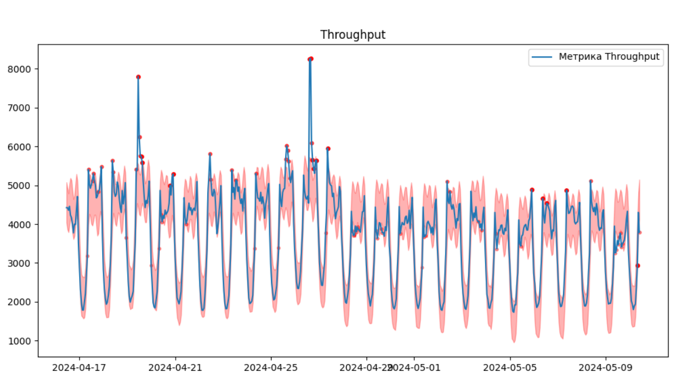

## Предварительные требования

Перед тем как начать, убедитесь, что у вас установлены следующие инструменты:

- Git
- Docker
- Docker Compose

## Установка

Следуйте инструкциям ниже, чтобы установить и запустить проект.

### Шаг 1: Клонирование репозитория

Склонируйте репозиторий на вашу локальную машину:

```sh
git clone https://github.com/ai-integration-company/anomalies_java.git
```

Перейдите в папку с проектом
```sh
cd anomalies_java
```
### Шаг 2: Сборка Docker Compose

```sh
docker-compose build
```
### Шаг 3: Запуск Docker Compose
```sh
docker-compose up
```
### Шаг 4: Откройте html файл serv.html и начните искать аномалии! Введите начало и конец временного окна и ждите примерно 30-60 секунд.

### Шаг 5: При проблемах со сборкой проекта обратиться к https://t.me/gsvasiliy

## Результаты. Более яркая и большая точка - больше вероятность, что аномалия. Красный прозрачный сектор - сектор нормального поведения.



